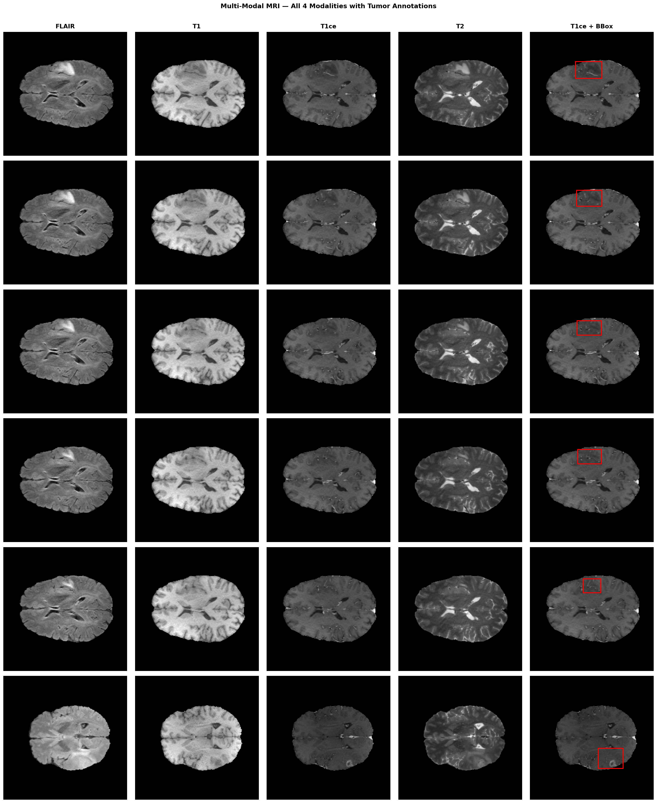
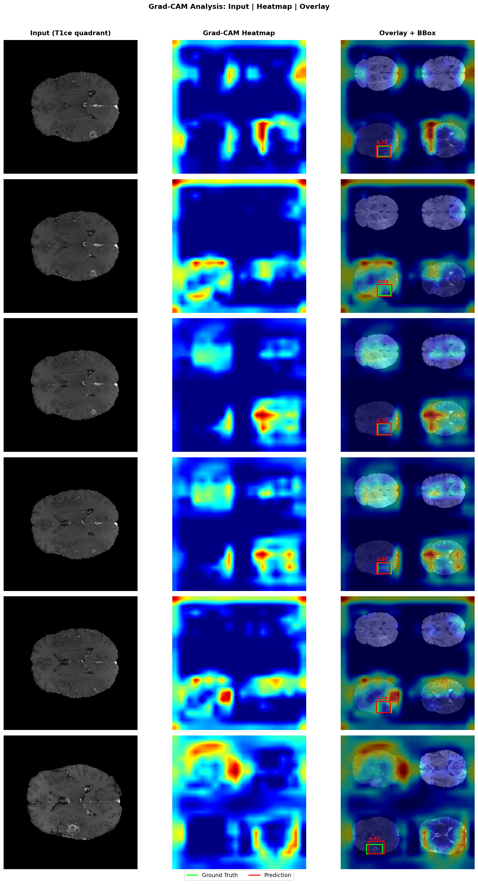
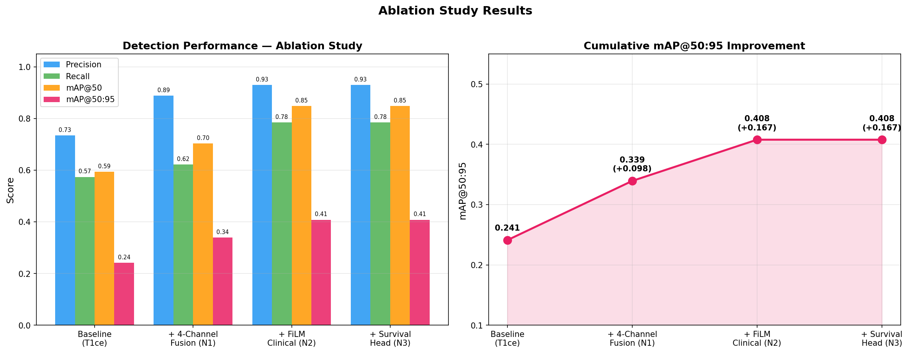
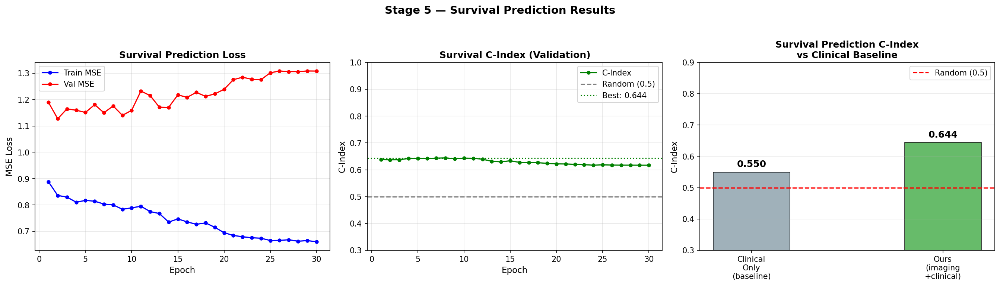

# BTDet-Multimodal

**Multimodal Brain Tumor Detection with Clinical-Guided Feature Modulation and Survival Prediction**

[](https://python.org)
[](https://pytorch.org)
[](https://ultralytics.com)
[](LICENSE)

## Overview

This repository extends the [BTDet](https://doi.org/10.1016/j.bspc.2025.109283) 
framework with three novel contributions for brain tumor detection using 
BraTS2020 MRI data combined with clinical survival information.

## Novel Contributions

| # | Contribution | Gain |
|---|---|---|
| N1 | **4-Channel MRI Fusion** — All 4 BraTS modalities (FLAIR, T1, T1ce, T2) fused via 2×2 grid encoding | +9.8% mAP@50:95 |
| N2 | **FiLM Clinical Injection** — Patient age and resection type modulate neck features via Feature-wise Linear Modulation | +6.9% mAP@50:95 |
| N3 | **Multi-Task Survival Head** — Simultaneous tumor detection and survival day regression from shared backbone | C-Index: 0.644 |

## Results

| Model | Precision | Recall | mAP@50 | mAP@50:95 | C-Index |
|---|---|---|---|---|---|
| YOLOv8-N (T1ce baseline) | 0.734 | 0.574 | 0.594 | 0.241 | — |
| + 4-Channel Fusion (N1) | 0.888 | 0.622 | 0.704 | 0.339 | — |
| + FiLM Clinical (N2) | 0.930 | 0.785 | 0.849 | 0.408 | — |
| + Survival Head (N3) FULL | 0.930 | 0.785 | 0.849 | **0.408** | **0.644** |

**Total improvement: +16.7% mAP@50:95 (+69.1% over baseline)**

## Figures

| Modality Comparison | Grad-CAM Heatmaps |
|---|---|
|  |  |

| Ablation Study | Survival Analysis |
|---|---|
|  |  |

## Datasets

- **BraTS2020** — Brain tumor MRI  
  `kagglehub.dataset_download("awsaf49/brats20-dataset-training-validation")`
- **Survival CSV** — Clinical data from BraTS2020 training set

## Installation
```bash
git clone https://github.com/YOUR_USERNAME/BTDet-Multimodal.git
cd BTDet-Multimodal
pip install ultralytics kagglehub nibabel scikit-learn grad-cam torch
```

## Usage

Open `notebooks/BTDet_Multimodal_Full.ipynb` in Google Colab and run 
all cells in order. The notebook is self-contained and downloads all 
required data automatically.

## Project Structure
```
BTDet-Multimodal/
├── notebooks/
│   └── BTDet_Multimodal_Full.ipynb   ← main notebook
├── src/
│   ├── dataset.py                     ← data pipeline
│   └── models.py                      ← FiLM + survival head
├── configs/
│   └── train_config.py                ← hyperparameters
├── figures/
│   ├── gradcam_figure.png
│   ├── modality_comparison.png
│   ├── ablation_chart.png
│   └── survival_figure.png
├── results/
│   └── *.pkl                          ← saved metrics
└── README.md
```

## Citation

If you use this work please cite:
```bibtex
@article{btdet2026,
  title   = {Multimodal Brain Tumor Detection with Clinical-Guided 
             Feature Modulation and Survival Prediction},
  journal = {Biomedical Signal Processing and Control},
  year    = {2026},
  note    = {Built upon BTDet: doi.org/10.1016/j.bspc.2025.109283}
}
```

## Acknowledgements

Built upon [BTDet](https://doi.org/10.1016/j.bspc.2025.109283) by 
Li et al. (2026). Dataset: BraTS2020.

## License

MIT License — see [LICENSE](LICENSE) for details.
